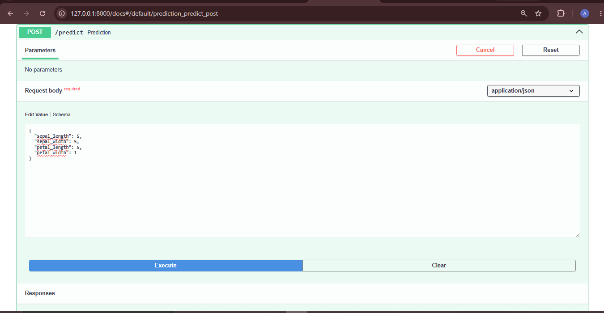
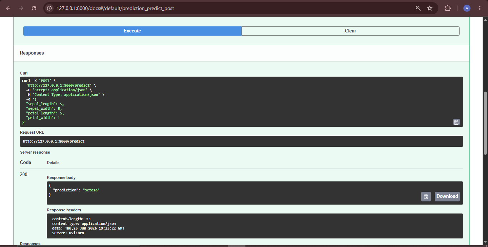

# Iris KNN API

## Project Overview

This project predicts the species of an Iris flower using a K-Nearest Neighbors (KNN) machine learning model deployed with FastAPI.

## Technologies Used

- Python
- FastAPI
- Scikit-learn
- Pandas
- Joblib
- Pydantic

## Dataset

- Iris Dataset from Scikit-learn

## How to Run

1. Install the dependencies

pip install -r requirements.txt

2. Train the model

python train.py

3. Run FastAPI

uvicorn main:app --reload

4. Open Swagger

http://127.0.0.1:8000/docs

## API Endpoint

POST /predict

Input

{
    "sepal_length": 5.1,
    "sepal_width": 3.5,
    "petal_length": 1.4,
    "petal_width": 0.2
}

Output

{
    "prediction": "setosa"
}

## Screenshots

### Swagger UI

### Prediction

